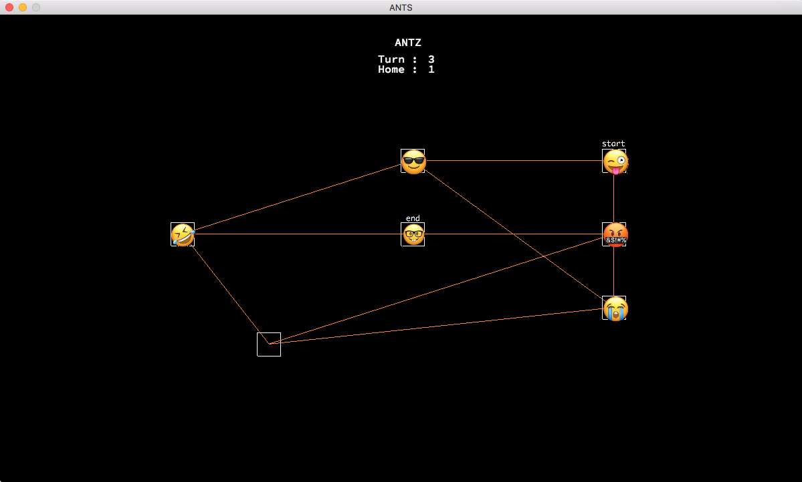

# Lem_in

Lem_in brings ants from a start room to an end room in the shortest amount of turns possible.

A dynamic application of the Dijkstra shortest path algorithm ensures that all paths to the end room are found, and the ants are split among them according to each route's distance.

Usage:
./lem_in < map

Maps are simple text files and must be formatted like the following example:

15 
##start 
start 16 3 
2 16 7 
3 16 3 
4 16 5 
5 9 3 
6 1 5 
7 4 8 
##end 
goal_room 9 5 
goal_room-4 
goal_room-6 
start-3 
4-3 
5-2 
3-5 
4-2 
2-start 
7-6 
7-2 
7-4 
6-5 
#example comment

The first line contains the number of ants. The rooms are then declared, formatted as 'name X-coordinate Y-coordinate'. The ##start and ##end commands tell the program the following room will be the start and end room respectively. Finally, the rooms are linked together to create the possible paths for the ants to take. More sample maps can be found in the <a href="https://github.com/SamLynnEvans/Lem_in/tree/master/maps">maps folder</a>.

Lem_in will output the turn-based movement of ants. Each ant can move one room at a time, and no two ants can occupy one room at the same time (apart form the start and end room). Each line represents one turn. The output of the above map would look like this.

L1-2 L2-3 L1-4 L2-5 L3-2 L4-3 L1-goal_room L2-6 L3-4 L4-5 L5-2 L6-3 L2-goal_room L3-goal_room L4-6 L5-4 L6-5 L7-2 L8-3 L4-goal_room L5-goal_room L6-6 L7-4 L8-5 L9-2 L10-3 L6-goal_room L7-goal_room L8-6 L9-4 L10-5 L11-2 L12-3 L8-goal_room L9-goal_room L10-6 L11-4 L12-5 L13-2 L14-3 L10-goal_room L11-goal_room L12-6 L13-4 L14-5 L15-2 L12-goal_room L13-goal_room L14-6 L15-4 L14-goal_room L15-goal_room 

Key 
L1-3 : ant 1 moves to room 3.

<b>Visualiser</b>

Call the visualiser by entering the vis folder, typing make, and entering the command:

../lem-in < ../maps/map_of_your_choice

Once the visualiser is running use the right and left arrows to move a turn forward or backward respectively. Press Escape key to exit.

The viusaliser was made with the school 42 and Epitech graphics library, minilibX. It is incredibly basic, essentially consisting of only a few functions that create a screen and allow you to put pixels on it. In order to print the emojis, I had to use numpy to turn the emoji images into arrays, and manipulate them into the correct format to use them in the minilibx. The actual pixel array form of the emjis can be seen in the emoji folder.

<b>Learnings</b>

1. How to implement shortest-path finding algortihms such as Dijkstra or A star.

2. My own implementation of Bresenham's straight line drawing algorithm for the visualiser.

3. I learnt how to turn images into numeric arrays and manipulate them using numpy so they could be formatted correctly and put as individual pixels in the visualiser.

3. Readability. I had to come back to this code to make some edits. Unfortunately the visualiser was utterly incomprehensible to me. This project was still from my early days in the school, and since then I have read the book 'Clean Code'. In future projects I aim to be more verbose, and split my functions more neatly, so that each function is assigned to one job.
